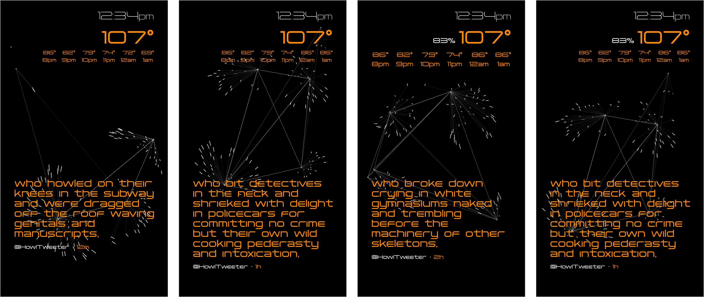

# Cybotrance
### BK Apt Dashboard

https://user-images.githubusercontent.com/46533657/186288905-a2b9d195-f923-4d10-83de-ccef49ff5716.mp4

 

## What it is?
This is a dashboard running in the entryway inside my apartment.

The dashboard presents the current time, weather and humidity (an important bit of data when living through NYC summers). It also presents the most recent tweet from https://twitter.com/howltweeter, and has a JS animation running to keep things kinetic.

Married to the face of the display is a one-way mirror. Essentially it reflects everything that has darker colors on the screen behind it, and presents information with lighter colors covering any reflections.

This is an earlier iteration of the project:

👆 video on youtube 👆

 

## Weather
I'd originally built something similar using the Weather Underground API. That fell off some time ago, so I turned to Dark Sky. Turns out that's on its way out as well. In steps the [WeatherKit REST API](https://developer.apple.com/documentation/weatherkitrestapi)

 

## Twitter
I plan on running tweet streams from different bots on the dashboard ... looking to incorporate narratives stretched out over time, and accessed by me asynchronously. For now I've settled on @howltweeter.

### @howltweeter
https://twitter.com/howltweeter
"All of Allen Ginsberg's Howl, One Line Every Hour, Over and Over."

### THE RIGHT SORT
My original idea was to stream [THE RIGHT SORT](https://twitter.com/SceptreBooks/timelines/488586138048004096) one tweet each day. I may fold this into Cybotrance a bit later, but Howl, because it's regularly posting, seemed like an easy integration now.

### Visual Artists
I'm also considering accounts that present visual art, and so am thinking about accounts like [@zachlieberman](https://twitter.com/zachlieberman). Right now I don't have a layout that would accept this type of content, so it's just an idea atm.

### Other Contenders
https://twitter.com/Kurt_Vonnegut

https://twitter.com/TheMarkTwain

https://twitter.com/ProfFeynman

 

## the-rice-grain-mayhem
Rounding things out is a JS animation lifted from the [codedoodl.es doodle source archive](https://github.com/fluuuid/codedoodl.es-doodles). I really wish I could get to the non-minified version of this doodle ... would love to study how it's built. Ahh vell.

https://github.com/fluuuid/codedoodl.es-doodles/tree/master/nicoptere/the-rice-grain-mayhem

